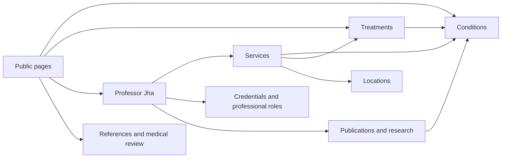

# SWATIJHA.COM — WordPress production architecture proposal

28 September 2026 · **For approval; no production code or migration performed**

## 1. Recommended approach and boundaries

Build a bespoke native block theme, `swatijha-theme`, supported by `swatijha-core`, a custom plugin for structured content, relationships, editorial review and schema. Retain existing public page URLs while changing how the underlying information is stored and presented. Editors create pages using curated Gutenberg patterns and select related entities through ordinary controls.

The visual phase is complete by the user's latest instruction. The approved Plum & Turquoise direction is authoritative, with the explicit correction that Professor Jha’s authentic photograph replaces the rejected ribbon artwork in the header/hero. Use the local `DESIGN-HANDOFF.md`, tokens, fonts, assets and corrected specimen. Do not reinterpret the design or reintroduce ribbons, synthetic portraits or the generated logo.

This proposal is documentation only. No theme/plugin scaffolding, dependency installation, WordPress database creation, content migration, redirect activation, staging provisioning or live-site modifications have occurred. The public crawl used GET requests only.

**Core choices proposed for approval:**

1. Native WordPress Pages own public URLs and narrative content; internal structured entities own reusable facts and relationships.
2. The plugin owns entity registration, data validation, business behaviour and structured data. The theme owns presentation and templates.
3. Core blocks and patterns handle ordinary content; a small set of plugin blocks handles entity-backed output.
4. No Elementor, Higgsfield, ACF or proprietary visual builder dependency. No frontend React application.
5. The plugin owns site metadata/schema in the new system. Import useful existing Rank Math values; do not run two competing graph generators.
6. Preserve all ordinary public page routes in the observed inventory; hold four legacy/noindex routes for explicit decisions before migration.

## 2. Read-only discovery completed

The declared sitemap index at `https://www.swatijha.com/sitemap_index.xml` contained a page sitemap plus two Liquid theme sitemaps. The local crawl fetched **26 sitemap URLs** and **3 additional same-host HTML links**, including the alternate root spelling without its trailing slash: **29 requested URLs / 28 distinct paths after root normalization**. The discoverable HTML queue was exhausted within the configured 220-URL bound.

All 29 requests returned a final HTTP 200 response. This is not proof that every URL is indexed or valuable. The final body’s title, H1, description, robots directive, canonical, headings, images, links and JSON-LD were recorded. Raw response bodies are preserved for later comparison. Body word counts include template text and are not main-article word counts.

Fresh findings:

- The ordinary clinical pages retain self-referencing HTTPS `www` canonicals. Preserve the current preferred host and paths.
- `/about/` is already established: retain it for the clinician biography rather than introducing `/professor-swati-jha/` merely for tidiness.
- Preserve `/vaginal-prolapse-treatment-sheffield/` as the existing hub. Do not create a competing `/prolapse-surgeon-sheffield/` route by default.
- The sitemap includes `/?liquid-footer=home` and `/liquid-archives/blog/`. They are theme-generated routes, currently with index directives; decide their disposition using search/link evidence before retirement.
- `/uncategorized/` and `/vaginal-prolapse-signs/` are linked but not sitemap entries and currently specify noindex. The latter needs comparison with `/symptoms/` before any merge.
- All extracted JSON-LD blocks parsed as JSON in this crawl; that does not establish semantic validity. Some clinical pages contain four to six blocks, so node duplication and conflicting facts still need a graph audit.
- The sitemap generator identifies Rank Math. Public markup is not an authenticated plugin inventory; obtain a read-only export later before deciding what to replace.

Evidence: [URL inventory](evidence/url-inventory.csv), [crawl details](evidence/crawl.json), local XML files and raw HTML. [Proposed URL map](OLD-TO-NEW-URL-MAP-PROPOSED.csv) covers every fetched URL. All approval fields are **PENDING**.

**Coverage limits:** no authenticated CMS export, Search Console, analytics, backlinks, server logs, historical redirects, orphan-page inventory or media-download validation was available in this pass. The crawl did not execute JavaScript, follow arbitrary query strings, or fetch off-site links/media. Thus “high-value” is not inferred from slugs; measured value remains unknown. The sitemap skill’s packaged runtime was unavailable, so discovery used the working declared sitemap and direct XML parsing without installing anything.

## 3. Proposed WordPress data model

### Public content and internal entities

Use `page` for retained public pages, `post` for genuine future editorial articles if needed, and `attachment` for local media. Clinical entity records are plugin-owned custom post types with editor UI and revisions but **no independent frontend routes or archives**. Public landing pages refer to them. This separates SEO route preservation from data normalization and avoids two competing pages for the same topic.

| Record | Storage | Main fields | Public rendering |
|---|---|---|---|
| Professor Swati Jha | `sj_clinician` | Entity UUID; display/legal names; title; biography summary; GMC identifier; portrait attachment; verified external identity URLs; specialties; credentials; roles | `/about/`, hero, author/reviewer panels |
| Credential | Typed repeatable clinician meta | Credential UUID; title; awarding body; awarded date; expiry if real; evidence URL; verified date/status | Credentials block; graph only when verified |
| Professional role | Typed repeatable clinician meta | Role UUID; organisation name/URL; role type: NHS/private/academic/honorary/national; start/end; current/past status; evidence | Profile and academic section |
| Condition | `sj_condition` | UUID; name; patient-friendly summary; optional verified terminology code; parent condition ID; specialty IDs; landing page ID | Existing condition/hub page and cards |
| Treatment | `sj_treatment` | UUID; name; category: conservative/pessary/medicine/surgical; summary; clinician-reviewed schema classification; related condition IDs; landing page ID | Treatment pages/options |
| Service | `sj_service` | UUID; service label; clinician IDs; condition/treatment IDs; location IDs; booking destination; modality; active status; optional verified fees | Booking, service cards, provider/location graph |
| Specialty | `sj_specialty` taxonomy | Label; description; optional verified vocabulary mapping | Entity filters, navigation labels; term archives disabled initially |
| Location | `sj_location` | UUID; official name; type; structured address; public telephone; verified coordinates; map/directions URL; actual availability; photo | `/clinic/`, booking/contact/location cards |
| Publication | `sj_publication` | UUID; title; work type; author names/order and local author IDs; DOI/PMID/ISBN; journal/publisher; date; source URL; topic IDs | Publication list and academic profile |
| Research project | `sj_research` | UUID; title; summary; status; verified role; collaborators; funder/grant details if publishable; dates; publication/topic IDs; evidence | Research section, no automatic new URLs |
| Reference | `sj_reference` | UUID; citation label; source organisation; title; URL/DOI; publication date if known; accessed/checked date | Reusable citation records linked to page sections |
| Patient/teaching resource | `sj_resource` | UUID; title; resource kind; local attachment or authorized external link; transcript/captions; audience; topic IDs; provenance | Existing `/leaflets/` and `/videos/` |
| Review | `sj_review` | UUID; source; source ID/URL; permitted excerpt; permitted display name; date; optional rating/scale; use permission; moderation state | Approved visible review cards, not automatic review-rich-result markup |
| Practice settings | Versioned, non-autoloaded settings | Primary clinician; published practice identity; selected clinic IDs; booking/contact routes; central public contacts; maintained review summary/source/date | Header/footer/CTAs and metadata |

Credentials and roles start as revisioned structured arrays on the clinician, avoiding unnecessary administrative screens. Each item has its own UUID and source fields. Promote them to separate entities only if genuine cross-clinician reuse justifies it. Publications can also serve as references via a typed relation; do not create duplicate reference records for the same DOI.

All entities have a UUID stable across environments, a schema version, provenance, verification status, and optional landing-page binding. Store WordPress IDs for local relationships; export/import UUIDs and remap IDs. Do not use production database IDs as permanent external identifiers.

### Landing-page binding and single-source rules

The authoritative `landing_page_id` is stored on the entity. The page editor exposes a friendly entity selector backed by that binding. Enforce one primary entity per landing page and at most one primary landing page per entity. Secondary relationships are separate lists. Avoid storing a second manually edited mirror value on the Page.

- Page blocks contain the readable clinical narrative, headings, patient explanations and FAQ answers.
- Entity meta contains reusable factual details and relationships. Do not duplicate whole medical articles in entity fields.
- A page’s reviewed summary feeds both its answer block and appropriate schema description; do not maintain invisible SEO-only medical claims.
- Fees belong to the relevant service/location combination with currency, effective date and verification, not to repeated card text. Never infer fees from old pages.
- Use WordPress accounts for permissions and revision authors; use `sj_clinician` for professional identity. Account email is never exposed as a public clinician contact by default.

### Medical review metadata

Register a typed schema on clinical Pages, Posts and relevant entities:

| Field | Type / behaviour |
|---|---|
| `author_entity_ids` | Ordered clinician UUID/ID references; separate from login author |
| `reviewer_entity_id` | Verified clinician record |
| `review_state` | Draft / awaiting clinical review / approved / re-review required |
| `medically_reviewed_on` | Explicit date entered by authorized reviewer; never automatically “today” |
| `review_due_on` | Explicit schedule, optional; not a fabricated public review date |
| `approved_revision_id` + content hash | Identifies exactly the approved narrative/meta snapshot |
| `reference_links` | Ordered objects: source entity, stable section anchor, citation label |
| `evidence_notes` | Private editorial notes; excluded from anonymous REST and schema |

Changing clinical content or related factual meta invalidates approval for that proposed revision. Do not overwrite the approved published version while a new clinical draft is under review. The implementation must provide an explicit pending-revision workflow with atomic promotion of narrative plus revisioned meta and an approval audit record; default WordPress draft status alone is insufficient for edits to an already published page. Deletion or material change of a shared fact flags affected pages for review.

### Validation, revisions and permissions

Use registered post meta with explicit REST schemas, sanitization and authorization; enable revisions for supported meta and test that restore includes relationship/clinical fields. Support `custom-fields` and `revisions` on participating types. Store arrays with item schemas, not arbitrary opaque JSON. [WordPress metadata reference](https://developer.wordpress.org/reference/functions/register_post_meta/).

Validate field types, identifier formats, HTTP(S) source URLs, relationship target types and existence, duplicate IDs, role dates and allowed schema classifications. Reject dangling references and invalid future review dates. Do not automatically retrieve arbitrary user-supplied remote URLs at save time.

Roles/capabilities: administrator manages configuration; content editor drafts narrative; clinical reviewer approves medical revisions; publisher publishes approved content; migration operator imports drafts. Capabilities, not role-name comparisons, govern access. Nonces supplement authorization. Private review notes/permissions are never output by public selectors or graph endpoints. No patient health records or enquiry messages belong in this content model.

## 4. Entity relationships and schema



| Relationship | Cardinality | Authoritative storage |
|---|---|---|
| Clinician → specialties | many-to-many | Taxonomy assignments |
| Service → clinician/condition/treatment/location | many-to-many for each | Typed service ID arrays |
| Treatment → condition | many-to-many | Treatment condition IDs |
| Publication/research/resource → topics and clinician | many-to-many | Typed owner-record arrays |
| Page → references and reviewer | many-to-many / one reviewer | Revisioned page metadata |
| Entity → primary landing page | optional one-to-one | Entity landing-page binding |
| Condition → broader condition | optional one parent | Condition parent ID, cycle checked |

Store each relationship once; derive inverse views. For the expected small catalogue, build a bounded, cached adjacency index from approved records rather than fragile serialized-meta `LIKE` searches. Cache invalidation follows affected entity/page UUIDs on save, review promotion, trash and restore. Revisit a dedicated relationship table only if measured catalogue/query scale demands it; none is proposed initially.

### Generated graph contract

The plugin generates one coherent page-scoped `@graph` from published, verified data and the current visible content. Stable IDs use the production canonical origin plus persistent UUID fragments; page IDs use final canonical URLs. Staging must not leak its hostname into an exported production graph. Never embed author-specific JSON-LD blobs in patterns.

- Clinician: `Person` for identity, authorship and review, with supported name, credential, occupation and identity properties. Service provider may point to this Person.
- Practice: a separate real `MedicalBusiness`/`MedicalOrganization` node only when the actual practice identity is verified; do not conflate Professor Jha with either hospital or imply hospital ownership.
- Locations: verified `Hospital`/appropriate place nodes; services describe provider and service location using supported properties.
- Conditions: `MedicalCondition`; treatments: `MedicalTherapy` or appropriate procedure subtype only after classification. `possibleTreatment` references correctly typed treatment nodes. A service is not automatically a medical procedure.
- Pages: `WebPage`/`MedicalWebPage`, `BreadcrumbList`; articles: `Article` where justified; publications: `ScholarlyArticle`/`Book`/other appropriate creative work; references via supported citation relationships.
- Specialties: map only to valid Schema.org enumeration values where they exist; retain more specific clinical terminology as text/DefinedTerm where appropriate. Do not invent enum URLs or a custom `treats` schema property.
- FAQ markup only from visible question/answer content. Never promise a Google rich result.
- Review/aggregate-rating markup disabled by default. Visible reviews may be shown with rights/source verification, but self-serving practice review stars must not be assumed eligible. [Google review guidance](https://developers.google.com/search/docs/appearance/structured-data/review-snippet).

Schema.org also defines `IndividualPhysician`, with medical-organisation inheritance. Do not blindly combine it with Person or duplicate identities merely because a generator suggests it. The initial model uses Person plus explicit service/practice/location nodes; any later mapping extension must be tested against the vocabulary and search-engine requirements. [Schema.org definition](https://schema.org/IndividualPhysician).

The plugin owns canonical, description, Open Graph and domain graph output in the new installation, while WordPress retains document-title and sitemap infrastructure. Filter those APIs rather than adding duplicate tags. Import existing SEO values during migration. Disable competing Rank Math/custom-snippet JSON-LD only in the new staging installation after comparison. No live plugin changes now.

## 5. Theme architecture — `swatijha-theme`

Native block theme with minimal PHP. `theme.json` version 3 holds the shared editor/frontend palette, font families, fluid type, spacing presets, layout widths and supported shadow presets. Use version-specific WordPress schema validation; the living reference may contain features absent from the pinned stable release. [Theme.json reference](https://developer.wordpress.org/block-editor/reference-guides/theme-json-reference/theme-json-living/).

```text
swatijha-theme/                    proposed, not created
  style.css                       theme metadata
  theme.json                      approved global tokens
  functions.php                   minimal assets/pattern/style setup
  templates/
    index.html, front-page.html, page.html, single.html
    archive.html, search.html, 404.html
    page-clinical.html, page-profile.html, page-resources.html
  parts/header.html, footer.html
  patterns/                       curated native block compositions
  styles/                         approved component style variations
  assets/css/                     layout/responsive/accessibility styles
  assets/js/                      only necessary small view interactions
  assets/fonts/                   local licensed fonts
  assets/images/                  approved local design assets
```

Preserve exact approved tokens: plum `#642C68`, turquoise `#27B9B0`, tangerine `#EE8B43`, lilac `#E5DDF1`, ink `#2A2234`, warm white `#FAFAF8`; Lora and Plus Jakarta Sans; 1280px wide layout, 720px reading cap; breakpoints 480/768/1024/1280/1536px. Use the detailed handoff for remaining values and contrast-safe semantic variants.

`theme.json` is the implementation token authority. Generated CSS aliases expose the `--sj-*` names to components; do not hand-maintain contradictory token copies. Breakpoint constants also drive responsive CSS and screenshot tests. Keep editor styles aligned with the frontend, including typography, spacing, image crops and focus treatment.

No business data registration, clinical approvals, schema or redirects in the theme. Default post content remains readable if the theme changes. Editor freedom: text, images, ordering of approved sections and supported variants; restricted arbitrary colour/type controls to preserve the approved design. Administrators can change global templates, but those changes must be exported/reviewed in Git to avoid invisible database overrides diverging from the source theme.

## 6. Plugin architecture — `swatijha-core`

```text
swatijha-core/                     proposed, not created
  swatijha-core.php                bootstrap, version and compatibility checks
  src/Content/                    CPT/taxonomy/meta registration
  src/Entities/                   repositories, validation, UUID mapping
  src/Relationships/              typed relationships and inverse index
  src/Editorial/                  pending revisions, approval and audit
  src/Schema/                     node builders, graph resolver, validator
  src/SEO/                        canonical/meta/sitemap integration
  src/Admin/                      editor panels and settings UI
  src/Blocks/                     server-side rendering and bindings
  src/Forms/                      minimal enquiry endpoint and adapter
  src/Migration/                  versioned, dry-run CLI import/export
  src/Infrastructure/             caching, upgrade and logging boundaries
  blocks/*/block.json              native block metadata and editor entrypoints
  build/                          distributable compiled assets
  languages/, tests/
```

Use namespaced PHP and prefixed registrations; native WordPress APIs before additional libraries. Custom post types belong in the plugin so changing themes preserves data registration. [WordPress guidance](https://developer.wordpress.org/plugins/post-types/registering-custom-post-types/).

All dynamic blocks render semantic HTML on the server, with minimal base styles to remain readable under another theme. Editor React is supplied through WordPress packages and is not shipped as a public SPA. Each block declares editor/view assets separately; no site-wide editor bundles.

Plugin upgrades are versioned and resumable. Deactivation does not delete records; uninstall preserves data unless a separately confirmed destructive action is performed. Export entities, references, review state and UUID-based relationships using WP-CLI/JSON plus content/media exports. A custom block fallback/export path preserves plain content if the plugin is deliberately removed; its feature behaviour naturally requires the owned plugin, not a third-party builder.

**Enquiries:** a native block provides a configured form, not arbitrary HTML. Server-side validation, rate limiting, honeypot and minimum-time checks; delivery adapter to the practice’s later-approved transport; no message-body logging or default database retention. No CAPTCHA/marketing tracker by default. Local/staging mail goes to a capture sink. Final fields, privacy wording, recipient and delivery provider require verification before activation. This is not a clinical record or appointment scheduling system.

## 7. Gutenberg component map

Patterns compose blocks; they do not duplicate the underlying entity values. A pattern is appropriate for a layout; a custom block is appropriate when content must query or edit structured data. `block.json` registers custom blocks, with stable attributes and migration/deprecation handlers. Use Block Bindings for supported simple core-block attributes; custom renderers for relationship queries, not unsupported binding hacks. [Bindings documentation](https://developer.wordpress.org/block-editor/reference-guides/block-api/block-bindings/).

| Approved components | Proposed Gutenberg implementation | Editing experience |
|---|---|---|
| Header/navigation/footer | Theme parts using core Group, Navigation, Site Logo/text and plugin practice-contact block | Select menu; edit centrally maintained contacts |
| Hero/portrait | `swatijha/hero` pattern using core Group, Columns, Heading, Paragraph, Image, Buttons | Edit narrative; choose real local portrait; preserve ratios |
| Buttons/text links | Core Buttons/Button and paragraph links with theme styles | Primary/secondary/reverse styles |
| Topic chips | Core linked list pattern; data-bound variant where needed | Choose labels/destinations or related topics |
| Service/symptom cards | `sj/entity-cards` dynamic block + native symptom-card pattern | Select entities, ordering and approved visual variant |
| Credentials | `sj/credentials` | Choose clinician; display verified credentials |
| Treatment options/pathway | `sj/treatment-options`; core ordered-list pathway pattern | Select treatments; edit reviewed step explanations |
| Clinician profile/faculty | `sj/clinician-profile`, `sj/contributors` | Select verified profiles; never invent faculty |
| Academic/publications/research | `sj/publications`, `sj/research` | Select/query approved records and sort order |
| Educational cards/resources | `sj/resources` and core Query pattern for real articles | Topic/audience/type selectors |
| Clinical answer/key points | Native Group/Heading/Paragraph/List pattern | Write directly in reviewed page content |
| Medical-review byline | `sj/medical-review` | Reads current approved revision metadata |
| References | `sj/references` | Pick source records and attach section anchors |
| Reviews | `sj/reviews` | Select permitted published excerpts; controlled source summary |
| Clinic locations | `sj/locations` | Select location records; contacts update centrally |
| FAQ | Core Details-based FAQ pattern; plugin extracts only marked FAQ pattern entries | Questions and answers are ordinary editor text |
| Enquiry | `sj/enquiry-form` | Select approved form configuration; labels editable within policy |
| CTA/referrer/notice | Native patterns and style variations | Edit copy/action; configure variant |
| Tables/lists/downloads | Core Table/List/File blocks with approved styles | Native editing; accessible labels/captions |
| Search/pagination | Core Search, Query and Query Pagination | Built-in WordPress functionality |
| Programme overview/modules | Native patterns composed from approved cards/Details/list | Only publish if a real offering is confirmed; no LMS implied |
| Video/audio/transcript | Core Video/Audio/File/Details; controlled external embed wrapper if needed | Local poster/captions/transcript; consent-aware external load |

**Example editor journey:** create a Page using “Clinical information”; retain its approved slug; bind the condition; write sections; select treatments, clinician, locations and references; request review; reviewer approves the exact revision; publisher releases it. Routine work needs no code or raw JSON-LD. The editor sidebar explains why an incomplete entity, review state or missing reference blocks publication.

## 8. Node.js 22, local development and testing proposal

Pin an exact supported **Node.js 22.x** patch at implementation, commit `.nvmrc`/equivalent and lockfile, set package engines and use `npm ci`. Node is build/test tooling, not required on the WordPress production server. Node 22 is in Maintenance LTS with scheduled end of life on 30 April 2027; plan a tested upgrade before then rather than silently changing the requested major now. [Official release schedule](https://github.com/nodejs/Release).

Local WordPress: proposed `@wordpress/env` Docker setup with pinned stable WordPress release, PHP 8.3 and compatible database. Test the plugin’s minimum supported WordPress version separately; use no Gutenberg development plugin as a production requirement. Confirm actual hosting compatibility before deployment. WordPress recommends PHP 8.3+ and MariaDB 10.11+ or MySQL 8.0+. [Requirements](https://wordpress.org/about/requirements/).

| Area | Proposed tool / check |
|---|---|
| Block JS build | `@wordpress/scripts`, externalized WordPress packages, pinned versions |
| CSS | PostCSS/autoprefixer/minification; component-scoped styles; no utility framework required |
| Lint/format | WordPress ESLint/Prettier conventions; Stylelint; PHPCS/WPCS; PHP lint |
| Image processing | `sharp` for bounded derivatives; preserve originals/metadata provenance; SVGO only on trusted SVG |
| PHP tests | PHPUnit + WordPress integration tests for permissions, schema, review workflow, revisions and migration |
| JS tests | Block attributes/transforms and editor interaction tests |
| Browser tests | Playwright + axe-core; keyboard/manual screen-reader verification supplements automation |
| Performance | Lighthouse CI budgets on representative pages; post-launch field CWV monitoring |
| Migration tests | URL-map coverage, one-hop redirects, canonical/meta parity, content/media/link reconciliation |
| Independence | Build and render with vendor hosts blocked; grep dependency manifests/output for forbidden SDK/asset URLs |

Proposed scripts: `dev`, `build`, `lint`, `format:check`, `test:unit`, `test:integration`, `test:e2e`, `test:a11y`, `test:performance`, `test:migration`, `assets:build`, `package`. These names are proposals, not configured commands yet. [WordPress scripts](https://developer.wordpress.org/block-editor/reference-guides/packages/packages-scripts/) and [environment](https://developer.wordpress.org/block-editor/reference-guides/packages/packages-env/) provide the starting toolchain; compatibility with the pinned Node patch must be exercised in CI.

### Repository and environment boundaries

Keep the existing handoff repository as the design/documentation history; extend it after approval with `wp-content/themes/swatijha-theme`, `wp-content/plugins/swatijha-core`, tooling, tests, fixtures and migration manifests. No separate production repository or remote is required without a later decision.

Track source, local licensed assets, token inputs, lockfiles, sanitized fixtures and approved migration maps. Keep secrets, production databases, patient data and generated dependency folders out of Git. Release ZIPs contain built assets so installation/editing does not require Node, Higgsfield or a paid account. Use short feature branches and reviewed commits; tag release artifacts with source revision and checksums.

Staging requires authenticated access plus noindex, isolated database, controlled canonical handling, blocked real mail/payment/booking writes and no production credentials. Merely adding noindex does not protect staging. Do not overwrite production with the staging database after real enquiries/content have continued there; final deployment must reconcile the approved content delta.

## 9. Migration strategy and approval gates

### Gate A — Approve architecture before production coding

Approve the data ownership, theme/plugin separation, component strategy and tooling in this document. Approval authorizes local implementation only, not live modification or migration. The user has specifically required a stop here.

### Gate B — Complete inventory and approve the URL map before migration

The attached map has 25 preservation rows (including two root spellings) and four hold rows. “KEEP URL / IMPROVE” means rebuild the underlying content without changing its address; it does not approve clinical copy or confirm search value.

Before signing the final map:

1. Obtain a read-only CMS export and media inventory, SEO metadata/snippet inventory, historical redirect configuration, and available Search Console/analytics/backlink/server-log exports. Exclude form submissions and patient data.
2. Reconcile all published/orphan/noindex/attachment routes and historical aliases against the public crawl. Refresh crawl immediately before cutover.
3. Add evidence-backed priority fields: search clicks/impressions, inbound links, conversions where lawfully available, clinical importance and content overlap. Do not label a page “low-value” because metrics are missing.
4. Resolve each hold: exact destination and 301 only for a truly equivalent replacement; 410 for deliberately retired content with no suitable successor; no unrelated homepage blanket redirects. Preserve noindex where intentionally required.
5. Approve a versioned complete map, including same-URL rows, redirects, intentional removals, canonical origin and media paths. No importer or server rules execute while any relevant row is pending.

### Gate C — Dry-run extraction and transformation on local/staging

Build an idempotent importer after architecture approval, but do not perform content migration until Gate B is signed. Its dry run reports proposed creations/updates and relationship resolution without writes.

Source stages: snapshot → extract rendered meaningful content and media/source IDs → classify clinical sections → map to native blocks and entity fields → human review. Do not import `_elementor_data`, inline positioning, theme shortcodes, layout wrappers or legacy script payloads as the new page body. Preserve meaningful lists, tables, references, downloads, headings and text; do not replace them with AI summaries. Store source URL/hash, source timestamp, mapping rule, target UUID and reconciliation status.

Convert profile qualifications/roles into source-backed structured items; condition narrative into reviewed page blocks; treatment choices into linked entities; clinics/contacts into central records; publications/references into deduplicated DOI/URL records; authorized testimonials into moderated records. Conflicting fees, roles, review counts or clinical claims become review tasks, not silently chosen values. Do not set review dates to the migration date.

Import as drafts/pending review into an isolated database. Importer uses UUID/source keys for upsert, transactional batches or recoverable checkpoints, relationship remapping after record creation, per-run audit log and rollback manifest. Never use blanket search-and-replace against serialized production data. Preserve original upload URLs where feasible; map moved media explicitly.

### Gate D — Staging acceptance

Compare each migrated page with its source: text/section presence, headings, canonical/title/description, internal links, assets, contact/booking flow, structured facts and review status. Remove Elementor/Liquid/Rank Math dependencies only in staging after equivalents pass. Test with those plugins absent, not merely disabled visually. An archived old theme is not a runtime requirement.

### Gate E — Separate launch authorization

Only after explicit later approval: verified backups and restore drill, final content freeze/delta sync, release artifact installation, approved redirects, crawler/sitemap checks, real enquiry test with consent, and monitored cutover. Prepare previous theme/plugin/data recovery plan and rollback triggers such as broken enquiry delivery, widespread 404s or canonical errors. No launch action is authorized by this proposal.

## 10. Performance, accessibility and independence acceptance

Targets: LCP <2.5s, INP <200ms, CLS <0.1 at the 75th percentile when field data exists. A local Lighthouse score alone does not demonstrate field CWV. Initial per-page budgets: owned public JS ≤35KB gzip, CSS ≤60KB gzip, initial fonts ≤120KB, hero image ≤220KB. Track required WordPress core assets separately and approve any budget changes with evidence.

Server-render content; load only block-specific view JS; no jQuery dependency in owned components; no autoplay; no automatic map/review/video embeds; defer optional third parties behind user action/consent. Local fonts, correctly sized image derivatives, explicit image dimensions, limited LCP preload and page/object caching with correct entity invalidation.

WCAG 2.2 AA acceptance includes colour/contrast, meaningful headings/landmarks, keyboard operation, visible unobscured focus, text enlargement/reflow, form errors, reduced motion, captions/transcripts and appropriate labels. Test approved desktop/tablet/mobile layouts, including 320px and either side of breakpoints. Automated axe checks supplement manual keyboard and screen-reader checks. The visual handoff’s 48px standalone control target remains binding.

Independence tests must prove that normal editing/publishing, clean installation from release ZIPs, compilation from locked sources, automated tests and deployment all work without Higgsfield or Elementor access. Reference PNGs in documentation are permitted; runtime/build fetches of vendor URLs are not. Runtime only needs WordPress/PHP/database and locally controlled media, plus any explicitly approved optional operational service such as email transport. Optional new artwork is exported into the repository before use.

## 11. Approval requested

Approve this architecture to begin **local implementation of the theme, plugin and Gutenberg library**. The migration map remains proposed until the missing evidence and four hold routes are resolved and explicitly approved. Production deployment remains a separate approval.

This document and its evidence are the deliverable for this phase. Stop after presenting them; do not start production coding without the user's response.
